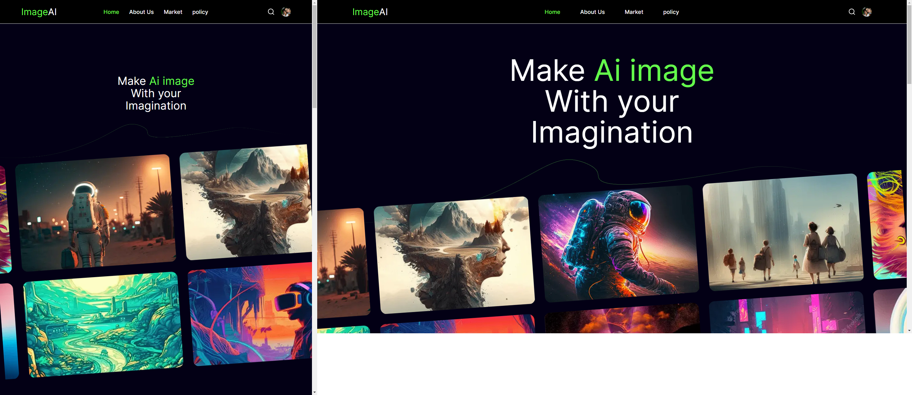

# ImageAi

## 💭 Descrição

Bem-vindo a ImageAi! Este é o projeto pessoal, que criei para estudo. Buscando me aperfeiçoar em TailwindCss e Authenticação de úsuario.
.

## 🖥️ Tecnologias Utilizadas

- [React](https://react.dev) - Framework do JavaScript, essa biblioteca ajuda na crianção de interfaces de usuário;
- [Next](https://nextjs.org/) - framework react para aplicações web, melhorando a perfomace do site;
- [Typescript](https://www.typescriptlang.org) - superset, framework do javaScript;
- [tailwind](https://tailwindcss.com/) - framework do CSS;
- [ESLint](https://eslint.org) - ferramenta de linting para identificar e corrigir problemas no código.
- [Prettier](https://prettier.io) - formatador de código que mantém um estilo de código consistente.
- [Clerk](https://https://clerk.com/) - biblioteca de autenticação que utiliza o nextAuth

## ✨ Feito por

| Foto                                                 | Nome                                   |
| ---------------------------------------------------- | -------------------------------------- |
|  | [Yan Castro](https://github.com/cplxx) |

## Licença

[MIT](https://choosealicense.com/licenses/mit/)
